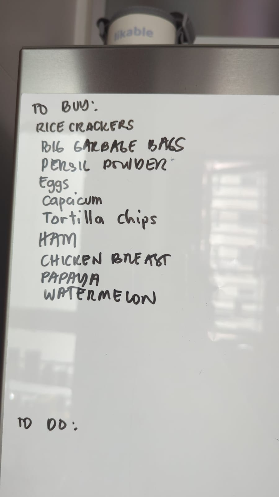

# RedMart Grocery Cart Helper

Turn a grocery-list photo into a prepared RedMart/Lazada cart, using your own usual products.

This is a lightweight pattern, not a full home automation system:

1. Take a photo of a grocery list, or type one out.
2. Match each item to your usual RedMart products in `grocery-catalog.yaml`.
3. Let an AI agent prepare the cart in a logged-in browser.
4. Review delivery, payment, and the final order yourself.

## Example

This example whiteboard list maps to the cart on the right:

<table>
  <tr>
    <td width="38%" valign="top">
      
    </td>
    <td width="62%" valign="top">
      <table>
        <tr>
          <th align="left">List item</th>
          <th align="left">Product</th>
          <th align="right">Qty</th>
        </tr>
        <tr><td>rice crackers</td><td>Ceres Organics Black Rice Crackers Thailand's Riceberry</td><td align="right">1</td></tr>
        <tr><td>big garbage bags</td><td>RedMart 50L HDPE Garbage Bag With Handle Ties</td><td align="right">2</td></tr>
        <tr><td>persil powder</td><td>Persil Anti-Bacterial Low Suds Powder Detergent 4.5KG</td><td align="right">1</td></tr>
        <tr><td>eggs</td><td>RedMart 15 Eggs 15 X 60G</td><td align="right">1</td></tr>
        <tr><td>capsicum</td><td>RedMart Traffic Light Capsicum Bell Peppers 3s</td><td align="right">1</td></tr>
        <tr><td>tortilla chips</td><td>Mission Multigrain Corn Chips</td><td align="right">1</td></tr>
        <tr><td>ham</td><td>RedMart Smoked Chicken Ham</td><td align="right">1</td></tr>
        <tr><td>chicken breast</td><td>FarmFresh Chicken Breast Boneless</td><td align="right">2</td></tr>
        <tr><td>papaya</td><td>Sumifru Solo Papaya</td><td align="right">1</td></tr>
        <tr><td>watermelon</td><td>Small Thai Watermelon</td><td align="right">1</td></tr>
      </table>
    </td>
  </tr>
</table>

An agent should show a proposed cart like this before it touches the browser. After approval, it opens the saved product URLs, checks delivery availability, adds the items, adjusts quantities, verifies the cart, and stops.

## One-Time Setup, Then Easier

The first setup is mostly the grocery shopping you would do anyway, just done on a computer instead of only in the mobile app. While you shop, leave the product pages or cart open so the agent can learn your preferred products and default quantities.

After that, normal runs are much easier: send a new photo, add a few text overrides, and let the agent prepare the cart.

You usually only need to log into Lazada/RedMart once in the browser the agent uses. The login should continue working through that browser's cookies/session state unless you log out, switch browser/profile/device, clear cookies, or the session expires.

After the initial catalog is built, update it only when your preferences change, RedMart changes a SKU, you want different default quantities, or you add fallback products.

## What You Need

- A RedMart/Lazada account.
- A computer with a browser already logged into that account.
- An AI agent that can read this repo and control that logged-in browser.
- A human who reviews the cart, chooses delivery, pays, and places the order.

For signed-in RedMart pages, the important requirement is browser access with your real logged-in state. The tested path for this repo is Codex with the Chrome extension, because it can use your Chrome profile and cookies. Computer Use can also operate a browser visually on macOS or Windows; macOS needs Screen Recording and Accessibility permissions, while Windows uses the foreground desktop while it works.

Other local browser-capable coding agents can use the same pattern if they can read the repo and operate a logged-in browser. For example, Google Antigravity or Claude tools may work when their local/browser-control setup exposes the needed browser session. The key test is simple: can the agent open RedMart in your logged-in browser, add an item, edit cart quantities, and stop before checkout?

## Quick Start

1. Put a grocery-list photo in this project, or attach it in the agent prompt.
2. Add any extras or overrides in plain language.
3. Make sure the browser is logged into Lazada/RedMart.
4. Ask the agent to use this project's RedMart grocery catalog.
5. Review the proposed cart before browser actions.
6. Let the agent add/update items and verify the cart.
7. Checkout manually.

Example prompt:

```text
Use this project's RedMart grocery catalog.
Read the attached grocery-list photo and prepare the cart.
Also add olive oil and coconut oil.
Skip ham this time.
```

Text overrides work well:

- `2 watermelons`
- `no detergent`
- `add sparkling wine`
- `skip chicken breast`

## Make It Yours

This repository ships with one family's grocery catalog. To adapt it for your own household, you do not need to edit YAML by hand. The easiest path is to let an AI agent rebuild the catalog from example RedMart tabs.

1. Make or photograph an example grocery list.
2. Log into Lazada/RedMart in the browser the agent can use.
3. Do a normal grocery shop on the computer once.
4. Open product pages for the items you buy often, or leave a representative cart open.
5. Ask an AI agent such as Codex, Claude Code, or another browser-capable coding agent to replace `grocery-catalog.yaml` with your products.
6. Give the normal words your household uses, such as `milk`, `eggs`, `trash bags`, or `dish soap`.
7. Review the generated catalog before using it for a real cart fill.

Useful setup prompt:

```text
I want to adapt this RedMart grocery repo for my family.
Use the RedMart product tabs and cart I have open.
Replace grocery-catalog.yaml with my products.
Use default quantities from the cart where possible.
Ask me about aliases if they are not obvious.
```

You do not need to finish the catalog in one sitting. A practical approach is to add items after normal grocery orders for a few weeks. After a couple of buys, most repeat items will be in the catalog. After that, you only need to update it when your preferred SKUs, default quantities, or fallback products change.

## Safety Rules

- The agent should not place the order.
- The agent should not submit payment or save payment details.
- The agent should stop at the cart unless explicitly asked otherwise.
- If a product is only available more than two days from now, the agent should ask or report it instead of adding it automatically.
- If handwriting or product matching is uncertain, the agent should show the uncertainty before adding that item.

## What Is In This Repo

- `grocery-catalog.yaml` - the source of truth for grocery aliases, default quantities, and preferred RedMart/Lazada product URLs.
- `AGENTS.md` - detailed instructions for browser-using agents that fill the cart.
- `examples/` - example grocery-list photos used to test the flow.

## Catalog Format

Each item in `grocery-catalog.yaml` has:

- `id` - stable local name used by agents.
- `aliases` - family-language terms from the board or prompt.
- `default_quantity` - quantity used when the list does not specify one.
- `preferred_products` - ranked product choices, with `rank: 1` as first preference.
- `pack_size` and `observed_price_sgd` - reference data, not strict buying rules.

Canonical Lazada product URLs use:

```text
https://www.lazada.sg/products/i<item_id>-s<sku_id>.html
```

Long tracking/search parameters such as `spm`, `priceCompare`, `search`, and `request_id` should not be stored as primary URLs.

## Notes

This repo contains household shopping preferences and example grocery-list images. Keep it private if that feels sensitive for your use case.
