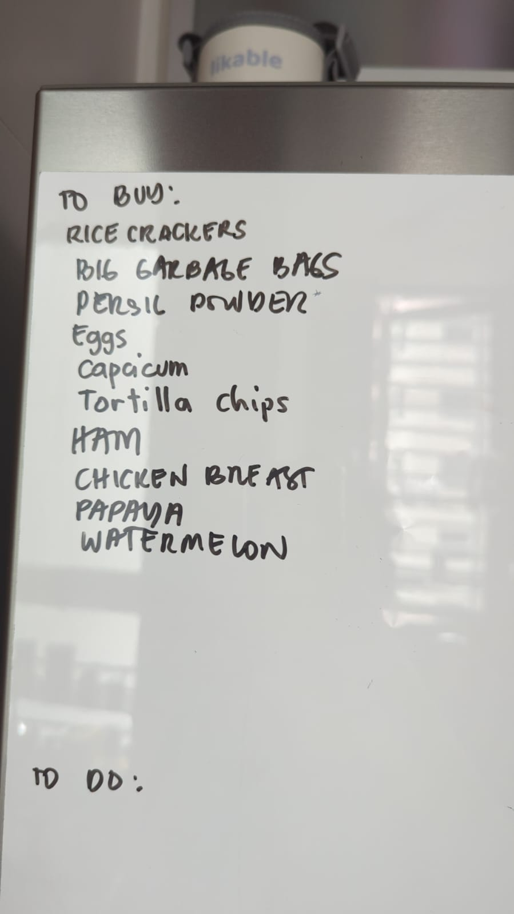

# RedMart Grocery Cart Helper

Turn your family grocery list into a prepared RedMart cart—with the products you already know and buy.

Send a whiteboard photo, dictate the list, or type it into the ChatGPT desktop app. Its built-in browser keeps the whole workflow in one app: the agent matches your family’s words to your usual groceries, lets each product page finish loading, checks availability, fills the cart, and verifies the exact products and quantities—including items collapsed into promotion groups.

**You stay in control.** The agent stops with the cart ready. You choose the delivery slot, pay, and place the order yourself.

## 🧺 What it looks like

This example starts with a family whiteboard. A voice note or typed list works the same way.

<table>
  <tr>
    <td width="38%" valign="top">
      
    </td>
    <td width="62%" valign="top">
      <table>
        <tr>
          <th align="left">Your list</th>
          <th align="left">Your usual product</th>
          <th align="right">Qty</th>
        </tr>
        <tr><td>rice crackers</td><td>Ceres Organics Black Rice Crackers</td><td align="right">1</td></tr>
        <tr><td>big garbage bags</td><td>RedMart 50L Garbage Bags</td><td align="right">2</td></tr>
        <tr><td>persil powder</td><td>Persil Anti-Bacterial Powder 4.5KG</td><td align="right">1</td></tr>
        <tr><td>eggs</td><td>RedMart 15 Eggs</td><td align="right">1</td></tr>
        <tr><td>capsicum</td><td>RedMart Traffic Light Capsicum</td><td align="right">1</td></tr>
        <tr><td>tortilla chips</td><td>Mission Multigrain Corn Chips</td><td align="right">1</td></tr>
        <tr><td>ham</td><td>RedMart Smoked Chicken Ham</td><td align="right">1</td></tr>
        <tr><td>chicken breast</td><td>FarmFresh Boneless Chicken Breast</td><td align="right">2</td></tr>
        <tr><td>papaya</td><td>Sumifru Solo Papaya</td><td align="right">1</td></tr>
        <tr><td>watermelon</td><td>Small Thai Watermelon</td><td align="right">1</td></tr>
      </table>
    </td>
  </tr>
</table>

Before touching RedMart, the agent shows you a proposed cart like this. A familiar word can stand for one usual product or a small mix your family has chosen. You can correct anything, add an item, or say `skip ham this time`.

When you ask it to fill the cart, the agent proceeds with the shown catalog matches—there is no second routine approval prompt. It checks approved backup products automatically when the first choice is unavailable, too late, or cannot be read safely. It changes quantities through exact product controls, then audits the cart, including promotion groups. An uncertain earlier Add click must be reconciled before any substitute is added.

It does not go to checkout.

## Why I built this

Our family used Amazon Fresh in Singapore due to its better logistics and less burdensome interface. Then Amazon stopped offering groceries here. We moved toward RedMart, but repeatedly finding the same products and adding them to the cart took more time than it felt like it should (juggling the delivery slots is already annoying enough).

Even with a list ready, grocery ordering had to fit into a commute, an evening, or part of the weekend. Put it off and we could miss a convenient delivery slot.

After a month or two, though, we had already made most of the decisions. We knew which eggs, detergent, snacks, fruit, and household products we normally wanted. We did not need AI to recommend surprising new things. We needed help completing a familiar task consistently.

That is the idea behind this project: **the family makes the decisions once; the agent handles the repetition.**

## 📱 Use it from your phone

The practical everyday flow is simple:

1. Install the [ChatGPT desktop app](https://chatgpt.com/download/) on the Mac or Windows computer that will prepare the cart.
2. Open this project in Codex mode and use **Set up Remote** to pair the ChatGPT mobile app with that computer.
3. Keep your chosen model and reasoning setting. If you want a starting recommendation for ChatGPT Desktop, **5.6 Terra / Medium** has two historical supervised cart tests; it is not a reliability guarantee or evidence for other harnesses.
4. In the desktop app’s built-in browser, open Lazada/RedMart. When ChatGPT asks for website access, verify that the hostname belongs to Lazada/RedMart and choose the persistent or **Always allow** option if it is offered. Then sign in once. Enter credentials only in the browser, never in chat.
5. Leave the desktop app running and the computer awake. Keep a Windows host unlocked while it is doing browser work.
6. From **Remote** in the mobile app, send a photo, dictate the list, or type it, then review the proposed cart.
7. Let the connected computer prepare and verify the cart. Choose delivery and check out yourself when convenient.

This is useful because the list can start wherever family life happens, while the repetitive browser work happens on the connected computer that already has your RedMart session. This workflow has been exercised with the built-in browser on both Mac and Windows, including Remote control of a Windows host.

The computer needs to stay awake, online, and signed into the right built-in browser profile while the agent works. Remote stops when the app closes or the host loses network access.

## What you need

- A RedMart/Lazada Singapore account.
- A Mac or Windows computer with the [ChatGPT desktop app](https://chatgpt.com/download/). On Mac, the current app requires macOS 14 and Apple Silicon (M1 or newer).
- The built-in Browser available in Codex. Availability can depend on your ChatGPT plan and workspace settings; 5.6 Terra with Medium reasoning is the tested setting for routine carts when the model control offers it.
- The ChatGPT mobile app if you want to use Remote from your phone.
- (Optional) A `.env` file with `USERNAME` and `PASSWORD`: copy `.env.example` to `.env` so the agent can automatically log back in if your Lazada session expires.

Other visible browser sessions are supported through the shared [browser connection hierarchy](docs/browser-connections.md): try an integrated signed-in view, then inspect existing household browsers and their authorized debugging/relay connections before requesting new setup. Browser selection already made in the conversation takes priority. Chrome and its control extension are optional fallbacks, not requirements. They can be useful when the built-in browser is unavailable to the main agent, during the documented signed-out recovery flow, or when you deliberately want to use an existing Chrome profile. A subagent that cannot expose the built-in browser should remain the planner or auditor while the main agent operates the visible built-in browser; that limitation is not a reason to switch browser profiles.

### OMP browser alternative

Oh My Pi (OMP) can run the same workflow through its Browser Relay extension in a visible, signed-in Chrome profile, or through an explicitly selected headed browser with a loopback-only CDP endpoint. Reuse the working channel and profile already chosen by the user; prefer the native relay when the alternatives are otherwise equivalent. OMP must not use a headless browser, guess a profile, expose a CDP port beyond loopback, inspect browser-private data, or cross the checkout boundary.

See the [OMP browser setup guide](docs/omp-setup.md). It maps OMP page observations and Puppeteer-style element handling to the exact identity, availability, quantity, manifest, promotion, and restoration rules in `AGENTS.md`. One reversible Browser Relay smoke test is recorded there; CDP catalog work was exercised in the September 14 T3 Code session; CDP cart mutations remain unqualified. The ChatGPT Desktop Terra/Medium benchmark does not establish equivalent model quality in OMP.

You do **not** need to understand the code or edit the grocery catalog yourself. Give the project to your agent and ask it to guide you.

Two historical ChatGPT Desktop tests used 5.6 Terra with Medium reasoning and reached verified carts with no observed judgment errors. A later OMP session, reported by the user as Terra, missed an approved backup and exposed browser/approval handling problems. The cross-model rules now explicitly cover those branches; they do not establish that every model passes them. See the [historical test notes](docs/model-benchmark-results-2026-08-14.md) and [reliability review](docs/developer-guide.md#session-reliability-review-2026-09-09).

The project itself is free. Your AI service may have its own plan or usage costs, and you still pay RedMart for the groceries you order.

## 🏠 Set it up for your family once

This project includes one family’s catalog as an example. Your agent can create yours from the RedMart orders you have already made.

Recent orders are a good starting point because they contain the products, pack sizes, and quantities your household actually chose. You review everything before it becomes part of your family catalog.

1. Open this project in Codex mode in the ChatGPT desktop app.
2. Ask the agent to open Lazada [My Orders](https://my.lazada.sg/customer/order/index/) in the built-in browser, then sign in there if prompted.
3. Paste the prompt below into your agent.
4. The agent finds your RedMart purchases and prepares a simple review page served only to your computer at `127.0.0.1`.
5. Mark one-off purchases as `Do not include`, adjust usual quantities, and add the words your family normally uses.
6. Click `Approve N products`, then return to the agent so it can finish.

```text
I want to set up this RedMart grocery helper for my household.
Please read this project's README.md and AGENTS.md, then guide me.
Use my RedMart orders from Lazada My Orders to propose my usual products.
Ignore Taobao and other sellers. Let me approve the review page before you
update the catalog. Do not choose delivery, go to checkout, or pay.
```

You do not need to build the entire catalog in one sitting. Start with recent repeat purchases and let it improve as your family shops normally.

Some family words can mean a small mix rather than one product: for example, `Sodaly` can be set up to fill with the flavours your family already buys. The total number you ask for is shared across those flavours. If you name a flavour, you still get just that flavour. If one flavour is out of stock, the agent tells you rather than quietly doubling the other.

### Add products from a later order

The same review page also supports small catalog updates. Ask the agent to inspect the last RedMart order, compare it with the existing catalog, and show only the useful additions or changes for approval.

```text
Add useful products from my last RedMart order to the household catalog.
Reuse the existing catalog review page, focus only on that order, and let me
approve the candidates before you edit grocery-catalog.yaml.
```

You can also say: `Compare today's order with my photo. Add missing family words or products, but show preference changes separately.` You should get one review page for the useful differences, not another review of every unchanged purchase. Buying a backup once does not silently make it the new default.

The agent reuses the candidate JSON and HTML renderer, resolves exact item/SKU IDs for included products, avoids duplicates, validates the catalog, and removes temporary review files afterward. After approving, leave that tab open until the agent confirms it read your choices. Approval lives in the open page, not in a saved account: reloading or closing it can lose the choices. If the agent cannot retrieve them, it must recover the existing page or explain the problem—not click Approve on your behalf.

## 🛒 Prepare the everyday cart

Once your family catalog is ready:

1. Attach a grocery-list photo, dictate the list, or type it.
2. Add any changes in ordinary language.
3. Ask the agent to prepare the cart using this project.
4. Review the proposed products and quantities.
5. Let the agent fill and verify the cart.
6. Choose delivery, pay, and place the order yourself.

Example:

```text
Use this project's RedMart grocery catalog.
Read my attached grocery list and prepare the cart.
Also add olive oil and coconut oil. Skip ham this time.
Show me the proposed cart before you use the browser.
```

Useful changes can be as simple as:

- `2 watermelons`
- `no detergent this time`
- `add sparkling wine`
- `skip chicken breast`

If a phrase does not match directly, the agent checks related household words and every ranked product before reporting it missing. It can offer a specific alternative—such as sliced cheddar for shredded cheddar—with the difference stated clearly. Confident matches continue while you decide.

The agent should interrupt you only for a real product/quantity ambiguity, a login challenge, browser access, or a safety blocker. Approved backups and normal default quantities need no extra question. If a requested brand is not catalogued, a related option can be offered with that difference explicit; it is added only if you accept. The rest of the cart continues.

## How it stays consistent

This is intentionally different from asking AI to shop around and recommend random products.

Your family catalog remembers:

- The words your family uses, such as `big garbage bags` or `persil powder`, including words that can mean a small usual mix.
- The exact products and pack sizes you normally buy.
- Your usual quantities, including how a mix is shared.
- Backup products you have already accepted.
- Specific wording that restricts the choice: “red apples” uses Royal Gala and “cheddar slices” uses cheddar, while generic “apples” and “sliced cheese” keep their usual rankings.

The agent also waits for the progressively loaded product page, checks when the exact saved SKU can be delivered, and confirms each product-page quantity change before moving on. It then reconciles the complete cart by exact item/SKU and quantity. Lazada can hide or split quantities inside promotion groups, so the agent checks the relevant promotion editor before treating a missing or partial-looking ordinary row as an error. If the match is unclear or no acceptable product is available soon enough, it leaves the decision to you.

## 🔒 You remain in control

- The agent stops before checkout.
- It does not choose a delivery slot.
- It does not submit or save payment information.
- It does not place the order.
- It shows uncertain matches before adding them.
- It stops if Lazada displays a CAPTCHA, slider, or unusual-traffic check so you can handle it yourself.

Your catalog and grocery-list photos describe household preferences. Keep the project private if that feels sensitive, and remove personal account or order information before sharing screenshots.

## If something gets stuck

- **ChatGPT asks to access a website:** check the hostname, then allow Lazada/RedMart or the local `127.0.0.1` review page. For Lazada/RedMart, choose the persistent or **Always allow** option if offered so future grocery runs do not need the same approval. Use one-time access for any hostname you do not recognize or do not expect. You can manage allowed and blocked sites under **Settings > Browser**.
- **Lazada asks you to sign in:** the agent first checks for an already signed-in household browser through the connection hierarchy. If none is usable, complete sign-in in the selected visible browser when prompted. Its login state is separate from the agent account.
- **A saved product is unavailable or its page will not load fully:** the agent must check the approved backup chain before handing that item back. If an earlier Add click is uncertain or a competing SKU is already in the cart, it first reconciles the cart to avoid duplicates. “Could not verify” is different from “out of stock.”
- **An item is not recognised:** the agent should first search household aliases and all ranked titles, then offer concrete related options. You can accept one for this cart or ask for new-product discovery. Permanent catalog changes still use review. A failed page read is not a missing catalog entry.
- **The cart count looks strange:** ask the agent to reconcile the complete expected list by exact product and quantity. The header is only a quick checksum, and promotion groups can hide or split ordinary rows; the agent should inspect the relevant promotion editor before changing anything.
- **A verification challenge appears:** complete it yourself; the agent should not try to bypass it.
- **A real Windows or macOS firewall alert appears:** do not disable the firewall or open a public port. The catalog review server is loopback-only. Stop and verify the alert identifies the expected ChatGPT or Node process before allowing anything.

## Use an old laptop if you like

This does not need to run on your main computer. A spare Mac or Windows laptop can act as the family grocery computer if it can run the ChatGPT desktop app, stays plugged in and awake, and remains logged into RedMart in the built-in browser. Keep a Windows host unlocked while it performs browser work.

## Want to improve it or add another retailer?

RedMart is the workflow currently used and tested by the project owner. I would be happy to work with people who actively use FairPrice, Sheng Siong, or another Singapore grocery service—but the new workflow needs a real household user who can build and test it together with me.

Developers and collaborators can find testing commands, repository details, contribution guidance, and the retailer proposal process in the [developer and contributor guide](docs/developer-guide.md). The broader product and AI lessons are in the [case study](docs/case-study.md).

This is a free, independent project. It is not affiliated with or endorsed by RedMart, Lazada, Amazon, FairPrice, or Sheng Siong.
