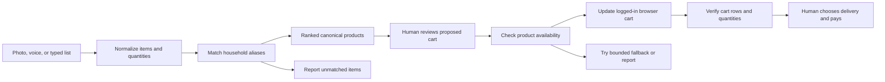

# Case study: consistency through constrained AI

## The problem was repetition, not discovery

Our family used Amazon Fresh in Singapore because the app was less frustrating than its website and delivery promotions were useful. When Amazon Fresh left the local grocery market, we moved toward RedMart. The selection worked for us, but repeatedly finding known products, adding them, fixing quantities, and getting a suitable delivery slot remained work.

That work competes with commutes, weekends, jobs, and family time. Put it off and a useful delivery slot can disappear. Yet after a month or two, most choices are no longer open questions: the household has already bought the eggs, detergent, fruit, and snacks it prefers.

This project asks AI to execute that known task. It does not ask AI to invent a shopping trip.

## Product principle

Open-ended recommendations can be helpful, but they also introduce decisions: is this unfamiliar brand, pack size, or price actually wanted? For repeat household administration, that uncertainty is often the opposite of assistance.

The design therefore makes the agent's action space explicit:

- Family phrases map to catalog aliases.
- Each household item has a known default quantity.
- Products have canonical retailer item and SKU identifiers.
- Ranked fallbacks constrain alternatives.
- Availability rules determine when a fallback is acceptable.
- A proposed cart is reviewed before browser mutation.
- The actual cart is verified after mutation.
- Delivery, payment, and checkout stay with the human.

Consistency comes from state, constraints, and verification—not a stronger prompt alone. The household makes the decisions once and delegates their repetition.

## Architecture

The catalog is small, inspectable household state rather than a general product database. Browser instructions are similarly explicit about identity, availability, stale state, verification prompts, and forbidden checkout actions.

## Engineering lessons

### Canonical identity beats titles

Retailer titles drift and similar pack sizes coexist. The durable comparison is `item_id` plus `sku_id`; titles remain useful for human review but are not the primary identity.

### Visible state can disagree with application state

Lazada overview pagination can update visible order cards while embedded data or links remain stale. Candidate drafting can use visible text, while canonical resolution must move through order details and product pages. Retrying brittle automation faster makes this worse.

### Preference and availability are separate

Rank 1 is the household preference, not an unconditional choice. The workflow accepts delivery today, tomorrow, or within two days, then tries a ranked fallback. Beyond that boundary, it asks the human.

### An action is not an outcome

Clicking “Add to cart” does not prove success. A product might already be present, a button might belong to a recommendation, or cart summary counts might be stale. Verification reads the actual row, canonical identifiers, pack size, and quantity.

### Human boundaries improve confidence

The agent may prepare a reversible cart. It does not select delivery, pay, or purchase. Approval before browser mutation and manual checkout make authority visible instead of relying on an implied safety promise.

## What this demonstrates

The applied-AI work is the complete system around the model: persistent preferences, bounded selection, browser-state recovery, approvals, outcome verification, privacy guidance, and failure reporting. The model handles language and interaction; the product design determines where it may act and how the result is checked.

The same pattern may apply to other repeated household tasks: use AI where intent is already known, store the relevant preferences explicitly, constrain execution, and leave consequential decisions with the person.

## Why RedMart remains the reference integration

It represents a real workflow the maintainer can exercise. FairPrice, Sheng Siong, or other retailers require an active household user who can co-develop and validate the integration in their own logged-in session. Each should start retailer-specific; common abstractions should emerge from two working implementations rather than speculation.

## Status and maintenance

The project is being hardened for a small Singapore tester cohort and will then move to best-effort maintenance. Automated checks remain credential-free. Live retailer checks happen before meaningful releases or in response to credible breakage reports. There is no promise of universal agent, browser, operating-system, or retailer compatibility.
